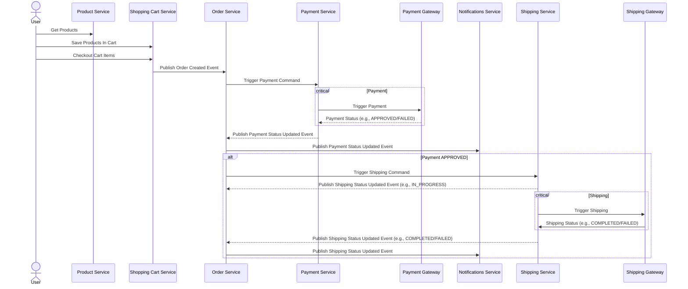
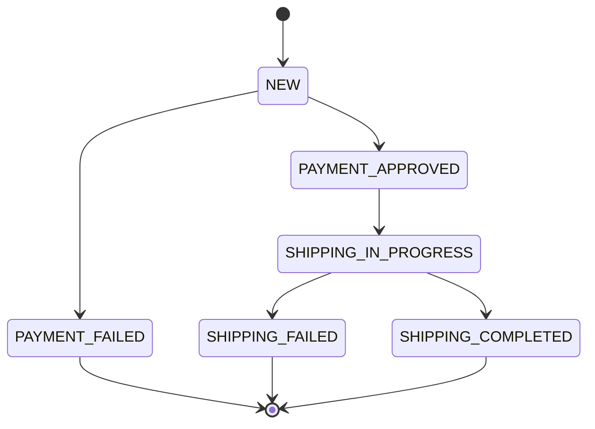

<p align="center">
  
</p>

<h1 align="center">eCommerce Application</h1>
<h4 align="center">⚡️ Architectural Empowerment: Applying Theory to Real-World Practice ⚡️</h4>

---

This eCommerce application is used for the didactic purpose only. It is a support project for [Ionut Balosin](https://www.ionutbalosin.com/training)'s training.

Please visit the author's [website](https://www.ionutbalosin.com) for more details.

---

## Content

- [High-level description](#high-level-description)
- [Architectural concepts](#architectural-concepts)
- [Architectural diagrams](#architectural-diagrams)
  - [Software architecture diagram](#software-architecture-diagram)
  - [Sequence diagram](#sequence-diagram)
  - [State diagram](#state-diagram)
- [Technology stack](#technology-stack)
- [SetUp](#setup)
- [License](#license)

## High-level description

The purpose of this application is to have a platform where customers can find products, shop around using a cart, check out the products and initiate payments.

The provided services are:
- *Account service* - handles the user data and exposes a GraphQL interface to retrieve the accounts. It comes with a prefilled user account
- *Product service* - handles the product catalog and exposes an API to create, retrieve, update, and delete products. It comes with a prefilled product catalog
- *Shopping cart service* - handles the user's shopping cart and exposes an API to create, retrieve, update, delete and check out the user's shopping cart items
- *Order service* - handles the user's orders and exposes an API to retrieve the historical orders and update them
- *Payment service* - handles the orders' payments using an external system
- *Shipping service* - handles the payment processing for successful orders by simulating their shipment to the destination
- *Notification service* - logs all received events to the console

## Architectural concepts

Among the **architectural styles, design tactics, and patterns** demonstrated in this project:

- Layered architecture, Hexagonal architecture, Event-driven microservices architecture
- API-driven development approach
- Schema-first development approach
- Shared-nothing database approach
- Schema registry
- REST architectural style (e.g., RESTful APIs)
- Scalability (e.g., horizontal scalability)
- Location decoupling
- Resiliency
- Caching (e.g., local/embedded)
- Asynchronous logging
- Change data capture design pattern
- Listen to yourself design pattern
- Data transfer object enterprise application pattern

## Architectural diagrams

### Software architecture diagram


### Sequence diagram

End to end sequence diagram:



### State diagram

Events state diagram:



## Technology stack

Among the **technologies, frameworks, and libraries** included in this project:

- [Spring Boot](https://spring.io/projects/spring-boot)
- [JdbcTemplate](https://docs.spring.io/spring-framework/docs/current/javadoc-api/org/springframework/jdbc/core/JdbcTemplate.html) (e.g., query, update, batch update)
- [Caffeine](https://github.com/ben-manes/caffeine) caching
- [Kafka](https://kafka.apache.org)
- [PostgreSQL](https://www.postgresql.org)
- [Flywaydb](https://flywaydb.org)
- [Debezium](https://debezium.io/)
- [Testcontainers](https://www.testcontainers.org)
- [Resilience4j](https://github.com/resilience4j/resilience4j) (e.g., circuit breaker, bulkhead)
- [Traefik](https://traefik.io) (i.e., HTTP reverse proxy and load balancer)
- [AVRO](https://avro.apache.org) and [JSON](https://www.json.org) data format
- [OpenAPI](https://www.openapis.org/) specification
- [GraphQL](https://graphql.org/)
- [Logback](https://logback.qos.ch/)
- [Spotless](https://github.com/diffplug/spotless) code formatter
- [Docker compose](https://docs.docker.com/compose/)
- [ArchUnit](https://www.archunit.org/)

## SetUp

Please make sure you have properly installed (and configured):

- JDK 21 (i.e., latest LTS)
- Docker
- cURL
- Postman

### Compile, run tests, and package

```
./mvnw clean package
```

**Note:** Please start the Docker agent up front, otherwise, the tests fail.

### Bootstrap all the services (and the dependencies) with Docker

```
./bootstrap.sh
```

To check if all Docker containers are up and running execute the below command:

```
docker ps -a
```

> **Important:** On Windows using Docker compose v2 there is a known [limitation](https://github.com/docker/compose/issues/8530) while horizontally scaling a service by using port ranges like "8080-8081:80".
> 
> At the moment, the workaround is to simply copy-paste (multiple times) the same service inside the Docker compose YAML file and explicitly assign different ports to each.

### Register the PostgreSQL connector

The PostgreSQL connector is used to monitor and record the row-level changes in the PostgreSQL database schema.

**Note:** please make sure all services (e.g., PostgreSQL and Kafka) are up and running before registering the connector 

```
./debezium-register-postgres.sh
```

Once the PostgreSQL connector is successfully registered, it reads the database log and produces events for row-level INSERT, UPDATE, and DELETE operations, emitting such events to the Kafka topic (in this case to the `ecommerce-product-cdc-topic`).

### Services overview via UI 

Open a browser and navigate to http://localhost:26060 to access the **Traefik UI** (it shows endpoints, routes, services, etc.). 

Open a browser and navigate to http://localhost:19000 to access the **Kafdrop UI** (it shows topics, partitions, consumers, messages, etc.).

Open a browser and navigate to http://localhost:18080 to access the **Debezium UI** (it shows the PostgreSQL connector).

Open a browser and navigate to http://localhost:55080/graphiql?path=/graphql to access the **GraphiQL** in-browser tool for writing, validating, and testing GraphQL `account-service` queries.

### Local tests with Postman

- open Postman
- import the provided API collections, corresponding to each project, as follows:
  - `./ecommerce-app/order-service/postman`
  - `./ecommerce-app/product-service/postman`
  - `./ecommerce-app/shopping-cart-service/postman`
- to simulate a basic test scenario please trigger the below requests (in this sequence):

```
GET http://localhost:{{port}}/products
```
```
POST http://localhost:{{port}}/cart/{{userId}}/items
```
```
POST http://localhost:{{port}}/cart/{{userId}}/checkout
```
```
GET http://localhost:{{port}}/orders/{{userId}}/history
```

**Note:** the ports (i.e., service port or Traefik load balancer port) are already configured as variables in the Postman collections

### TODOs

A few, optional, TODOs for further enhancements might be:

- implement a scheduler to reply unprocessed/failed events
- implement API pagination
- implement database bulk updates for the remaining APIs

## License

Please see the [LICENSE](LICENSE.md) file for full license.

```
/**
*  eCommerce Application
*
*  Copyright (c) 2022 - 2023 Ionut Balosin
*  Website: www.ionutbalosin.com
*  Twitter: @ionutbalosin / Mastodon: ionutbalosin@mastodon.socia
*
*
*  MIT License
*
*  Permission is hereby granted, free of charge, to any person obtaining a copy
*  of this software and associated documentation files (the "Software"), to deal
*  in the Software without restriction, including without limitation the rights
*  to use, copy, modify, merge, publish, distribute, sublicense, and/or sell
*  copies of the Software, and to permit persons to whom the Software is
*  furnished to do so, subject to the following conditions:
*
*  The above copyright notice and this permission notice shall be included in all
*  copies or substantial portions of the Software.
*
*  THE SOFTWARE IS PROVIDED "AS IS", WITHOUT WARRANTY OF ANY KIND, EXPRESS OR
*  IMPLIED, INCLUDING BUT NOT LIMITED TO THE WARRANTIES OF MERCHANTABILITY,
*  FITNESS FOR A PARTICULAR PURPOSE AND NONINFRINGEMENT. IN NO EVENT SHALL THE
*  AUTHORS OR COPYRIGHT HOLDERS BE LIABLE FOR ANY CLAIM, DAMAGES OR OTHER
*  LIABILITY, WHETHER IN AN ACTION OF CONTRACT, TORT OR OTHERWISE, ARISING FROM,
*  OUT OF OR IN CONNECTION WITH THE SOFTWARE OR THE USE OR OTHER DEALINGS IN THE
*  SOFTWARE.
*
*/
```